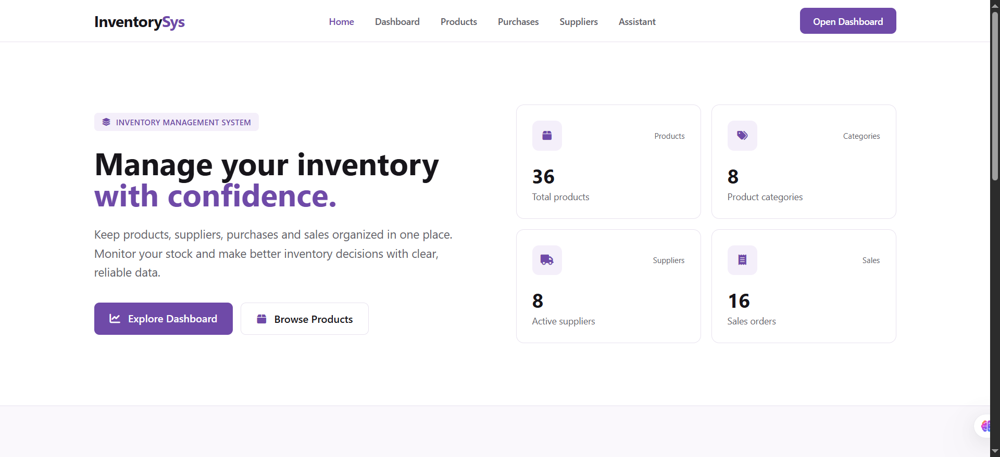
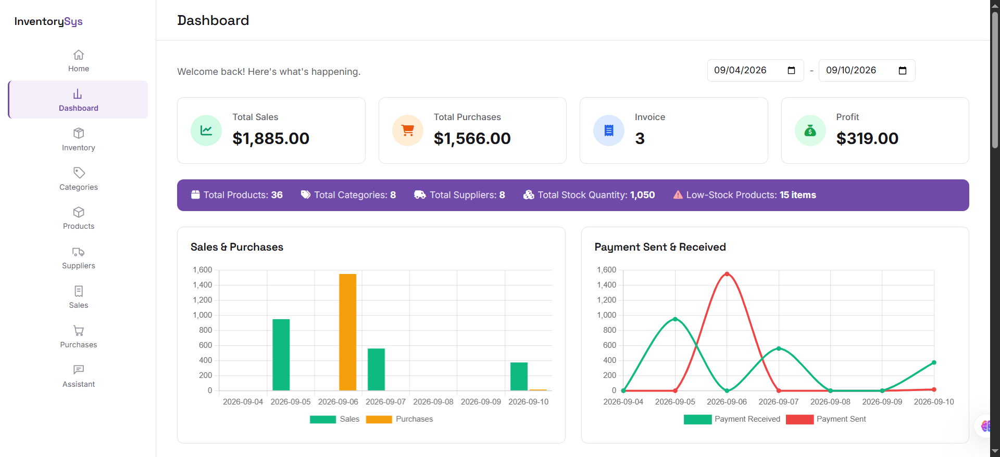

# Inventory Management System

A full-stack inventory, purchasing, and sales management application built with ASP.NET Core MVC and Entity Framework Core. The system tracks products, suppliers, categories, purchases, and sales, and includes an AI-powered assistant that can answer natural-language questions about live inventory data.

[](https://dotnet.microsoft.com/)
[](https://learn.microsoft.com/aspnet/core)
[](https://learn.microsoft.com/ef/core)
[](https://www.microsoft.com/sql-server)
[](#license)

---

## Table of Contents

- [What Is It?](#what-is-it)
- [Tech Stack](#tech-stack)
- [Features](#features)
- [Architecture](#architecture)
- [Screenshots](#screenshots)
- [AI Assistant (RAG)](#ai-assistant-rag)
- [How to Run](#how-to-run)
- [Database Setup](#database-setup)
- [Demo Credentials](#demo-credentials)
- [Git Workflow / Team Collaboration](#git-workflow--team-collaboration)
- [Project Structure](#project-structure)
- [Team](#team)
- [License](#license)

---

## What Is It?

The Inventory Management System is a web application that helps a business track stock levels, manage suppliers and product catalogs, and record purchase and sales transactions in one place. It was built as a graduation project during ITI summer training, with the goal of applying real-world software practices: layered architecture, Code First database design, source control with a team workflow, and integration of a generative AI feature on top of live application data.

The system covers the full inventory lifecycle:

- Organizing products under categories and linking them to one or more suppliers.
- Recording purchases from suppliers, which automatically increases stock.
- Recording sales to customers, which automatically decreases stock and blocks the transaction if stock is insufficient.
- Searching, filtering, and browsing the product catalog with pagination.
- Asking an AI assistant questions about current inventory in plain language.

## Tech Stack

| Layer | Technology |
|---|---|
| Backend Framework | ASP.NET Core MVC |
| ORM | Entity Framework Core (Code First) |
| Database | Microsoft SQL Server |
| Frontend | Razor Views, Bootstrap 5, custom CSS theme |
| Fonts | Inter, Space Grotesk |
| AI / RAG | Google Gemini API (`gemini-3.6-flash`) |
| Source Control | Git and GitHub (branch protection, pull requests, automated Copilot reviews) |
| IDE | Visual Studio |

## Features

### Product Catalog
- Full CRUD for products, categories, and suppliers.
- Search by product name or SKU.
- Filter by category and by stock status (in stock, low stock, out of stock).
- Pagination with a compact page range (current page plus/minus two).
- Accessible markup with `aria-label` attributes on interactive controls.

### Purchasing and Sales
- Record purchases from suppliers; stock is incremented automatically through a dedicated stock service.
- Record sales to customers; stock is decremented automatically, with the transaction rejected if requested quantity exceeds available stock.
- Many-to-many relationship between suppliers and products, so a product can be sourced from multiple suppliers.

### AI Assistant (RAG)
- Chat-style assistant answers questions about the current state of inventory using live data from the database.
- Conversation memory within a session.
- Quick-question suggestions and formatted, readable responses.

### UI / UX
- Custom dark-themed sidebar with a purple/violet accent color.
- Consistent typography using Inter and Space Grotesk.
- Clean, distraction-free interface with no decorative icons or emojis, focused on data clarity.

## Architecture

The application follows a straightforward layered structure on top of ASP.NET Core MVC, avoiding unnecessary abstraction layers:

```
Controllers  ->  Services  ->  EF Core DbContext  ->  SQL Server
                     |
                 ViewModels / Views (Razor + Bootstrap)
```

**Core entities**

| Entity | Purpose |
|---|---|
| `Category` | Groups products |
| `Supplier` | Vendor that supplies products |
| `Product` | Item tracked in inventory |
| `SupplierProduct` | Many-to-many join between suppliers and products (composite key) |
| `Purchase` / `PurchaseItem` | Records of stock coming in from a supplier |
| `Sale` / `SaleItem` | Records of stock going out to a customer |

**Key design decisions**

- `StockService` centralizes all stock increment and decrement logic. Attempting a sale that exceeds available stock throws an `InvalidOperationException`, which is caught and surfaced to the user as a validation message.
- Navigation properties are marked `[ValidateNever]` so that EF Core relationships do not cause false negatives in `ModelState.IsValid` during form submissions.
- The `SupplierProduct` join entity uses an explicitly configured composite primary key in `OnModelCreating`, since it has no single natural key.
- Database schema is generated from code using EF Core Code First migrations rather than being designed in the database first.

## Screenshots

### Home


### Dashboard


> More views can be added the same way. Save the image in `screenshots/` and add a line like ``. Worth adding later: Product List (search/filters/pagination), Add Purchase, Record Sale, and the AI Assistant chat.

## AI Assistant (RAG)

The assistant answers questions about inventory using a lightweight retrieval approach rather than a vector database:

- Relevant data is pulled directly from `AppDbContext` at request time and summarized as plain text, which is passed to the Gemini API as context.
- Model used: `gemini-3.6-flash`.
- The last five question-and-answer pairs are kept in session memory so the assistant retains short-term conversation context.
- Responses are rendered as formatted HTML inside a chat-bubble interface with a fixed header and message composer, a scrollable message area, quick-question chips, per-answer timestamps, and a loading indicator while a response is being generated.

**Configuration note:** the Gemini API key must be stored in `appsettings.Development.json` (excluded from source control), not in `appsettings.json`, to avoid the key being blocked or leaked through GitHub Push Protection.

```json
// appsettings.Development.json
{
  "Gemini": {
    "ApiKey": "YOUR_GEMINI_API_KEY"
  }
}
```

## How to Run

### Prerequisites

- [.NET SDK 10.0](https://dotnet.microsoft.com/download) or later
- [SQL Server](https://www.microsoft.com/sql-server) (Express, Developer, or LocalDB)
- A Gemini API key from [Google AI Studio](https://aistudio.google.com/) (required only for the AI assistant feature)

### Steps

```bash
# 1. Clone the repository
git clone https://github.com/ahmedosamaexe/InventoryManagementSystem.git
cd InventoryManagementSystem

# 2. Restore dependencies
dotnet restore

# 3. Add your local configuration (connection string + Gemini key)
#    Create appsettings.Development.json in the main project folder (see Database Setup and AI Assistant sections)

# 4. Apply database migrations
dotnet ef database update

# 5. Run the application
dotnet run
```

By default the application will be available at `https://localhost:5001` (or the port shown in the console output).

## Database Setup

The database is created using EF Core Code First migrations, so the schema is generated from the entity classes rather than being scripted by hand.

1. Add a connection string in `appsettings.Development.json`:

```json
{
  "ConnectionStrings": {
    "DefaultConnection": "Server=YOUR_SERVER;Database=InventoryManagementDb;Trusted_Connection=True;TrustServerCertificate=True"
  }
}
```

2. Apply the migrations to create the database and schema:

```bash
dotnet ef database update
```

3. (Optional) If you change any entity classes, generate a new migration before updating the database:

```bash
dotnet ef migrations add YourMigrationName
dotnet ef database update
```

## Demo Credentials

No demo account is currently seeded in the database. If seed data or a demo login is added later, update this section with the details, for example:

```
Email:    demo@example.com
Password: Demo@12345
```

## Git Workflow / Team Collaboration

This project was built by a team using a structured GitHub workflow:

- **Branch protection** is enabled on `master`; no direct pushes are allowed.
- All changes go through **pull requests**, reviewed by teammates before merging.
- **GitHub Copilot** automated code review runs on each pull request as an additional check.
- Each feature is developed on its own **feature branch**, named after the module it implements, for example:
  - `feature/product-list-enhancements`
  - `feature/rag`
- Merge commits are used to preserve branch history rather than rebasing shared branches.

## Project Structure

```
InventoryManagementSystem/
├── Controllers/
├── Models/
│   ├── Category.cs
│   ├── Supplier.cs
│   ├── Product.cs
│   ├── SupplierProduct.cs
│   ├── Purchase.cs
│   ├── PurchaseItem.cs
│   ├── Sale.cs
│   └── SaleItem.cs
├── Services/
│   ├── StockService.cs
│   └── RagAssistantService.cs
├── Data/
│   └── AppDbContext.cs
├── Views/
├── wwwroot/
│   ├── css/
│   └── js/
├── screenshots/            # add project screenshots here
├── appsettings.json
├── appsettings.Development.json   # git-ignored, holds local secrets
└── README.md
```

## Team

| Member | GitHub | Main Contribution |
|---|---|---|
| **Ahmed Osama** | [`ahmedosamaexe`](https://github.com/ahmedosamaexe) | Products + AI/RAG + Improvements & Fixes |
| **Esraa** | [`EsraaKamel1194`](https://github.com/EsraaKamel1194) | Suppliers + Sales + Inventory |
| **Ibrahim** | [`hemaahla`](https://github.com/hemaahla) | Purchasing Module |
| **Amr Fahmy** | [`Amr-Fahmy-1`](https://github.com/Amr-Fahmy-1) | Dashboard + Landing Page + Purchases UI |

## License

This project was developed for educational purposes as part of ITI (Information Technology Institute) summer training, Menoufia Branch.
